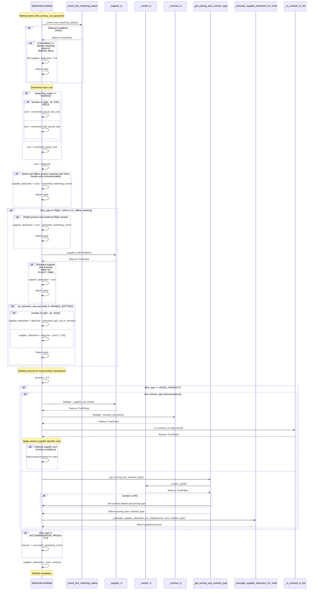

# Sequence Diagram for `_compute_supplier_deduction` Method

## Explanation of the Sequence Diagram

The sequence diagram illustrates the flow of the `_compute_supplier_deduction` method, which calculates the supplier deduction amount based on various business rules and conditions. Here's a breakdown of the key steps:

1. **Initial Checks**:
   - The method first checks for special conditions (cancellation, specific matching statuses, or EMKAN_SKU) that would result in zero deduction.
   - If any of these conditions are met, it sets `supplier_deduction = 0.0` and returns early.

2. **Base Cost Determination**:
   - Depending on the matching status and vendor type, it determines the base cost from either `converted_actual_net_cost`, `converted_total_actual_cost`, or `converted_quote_cost`.
   - The cost is then converted to an absolute value.

3. **Special Case Handling**:
   - For hotel/offline products matched with "other" vendor and having commission, it calculates a specific deduction and returns early.
   - For flight products or offline bookings, it applies various rules based on vendor type, domestic status, and VAT considerations.

4. **Hotel Product Processing**:
   - For hotel products, it handles two scenarios:
     - For old transactions without contract_type, it applies various supplier-specific rules.
     - For newer transactions with contract_type, it gets the pricing and contract type and calculates the deduction accordingly.

5. **Accommodation Product Handling**:
   - For accommodation products, it subtracts the marketing commission from the amount.

6. **Final Calculation**:
   - Finally, it sets `supplier_deduction = cost + amount` to determine the final supplier deduction value.

The diagram shows the complex decision tree and the various helper methods called during the calculation process, illustrating how different business rules are applied based on product type, supplier, contract, and other factors.