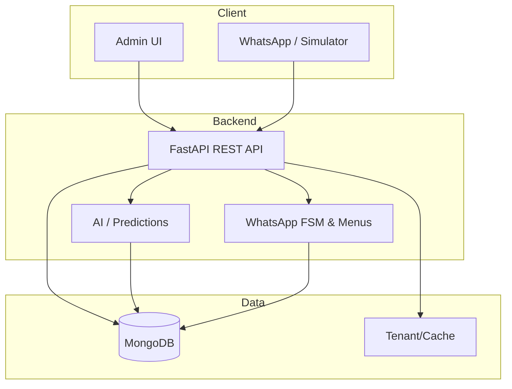
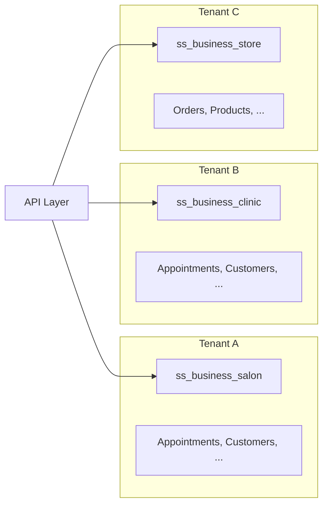
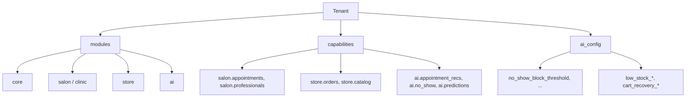

# Application Guide — Multi-Industry SaaS Platform

This document describes the **functionality**, **use cases**, **technical architecture**, and **demo setup** of the multi-tenant SaaS application. It is intended for stakeholders, clients, and developers who need a complete picture of what the system does and how to demonstrate it.

---

## 1. Overview

The platform is a **multi-tenant SaaS** that supports multiple **industries** (salon, clinic, gym, school, store, camp, car showroom, etc.) with:

- **Appointment booking** (professionals, slots, no-show handling)
- **Store** (products, inventory, orders, cart recovery)
- **AI features** (no-show prediction & blocking, slot recommendations, low-stock forecast, cart recovery insights, dynamic pricing guardrails)
- **WhatsApp** (menus, triggers, FSM-based booking, workflows)
- **Core** (customers, staff, promotions, follow-ups, reports, retention)

Each **tenant** has a **category** (e.g. `salon`, `clinic`, `store`) and **modules/capabilities** that determine which features are available. Data is isolated per tenant.

---

## 2. Architecture

### 2.1 High-level architecture



### 2.2 Tenant and data isolation



All tenant-scoped collections (appointments, customers, professionals, orders, products, etc.) include a **`tenant`** field. The API resolves the tenant from the URL path (`/tenants/{tenant}/...`) and from the authenticated user (tenant_admin is scoped to one tenant; super_admin can switch).

### 2.3 Module and capability model



- **modules**: e.g. `core`, `salon`, `clinic`, `store`, `ai`. Control which verticals are enabled.
- **capabilities**: Fine-grained permissions (e.g. `salon.appointments`, `ai.no_show`). Used for UI visibility and API access.
- **ai_config**: Tenant-level thresholds and toggles (no-show block threshold, low-stock defaults, cart recovery window, etc.). Stored in the tenant document and merged with defaults at runtime.

### 2.4 Role-Based Access Control (RBAC) — View / Edit / Edit Sensitive / Delete

Access is enforced per entity with four levels:

| Level | Description | Example |
|-------|-------------|--------|
| **View** | Read-only: list, open details | `salon.professionals.view`, `store.orders.view` |
| **Edit** | Change operational data (no sensitive fields) | Slots, status, availability; order status |
| **Edit sensitive** | Change sensitive data (fees, PII, payment details) | Professional fees/education; refunds |
| **Delete** | Cancel/delete records | `salon.appointments.delete`, `store.orders.delete` |

**By role:**

| Role | View data | Edit data | Edit sensitive |
|------|-----------|-----------|-----------------|
| **Tenant Admin / Super Admin** | ✅ All | ✅ All | ✅ All |
| **Staff (with .edit)** | ✅ | ✅ | ❌ |
| **Viewer (view only)** | ✅ | ❌ | ❌ |

- **Tenant Admin** and **Super Admin** have full access on all pages (no capability checks).
- **Staff** see only modules/capabilities assigned to them. Within each module, they get **view** and optionally **edit**; **edit_sensitive** is assigned separately (e.g. professional fees, refunds) and is typically given only to trusted roles.
- When creating a staff user, the tenant assigns capabilities per module (View / Edit / Edit sensitive / Delete) in the Create User screen; the UI shows these options grouped by module.

Capability IDs follow the pattern `{module}.{entity}.view`, `.edit`, `.edit_sensitive`, `.delete` (e.g. `salon.professionals.view`, `salon.professionals.edit_sensitive`). Legacy IDs (e.g. `salon.professionals`, `salon.professionals.manage`) are still supported for backward compatibility.

### 2.5 Super Admin

Only users with role **super_admin** can:

- **Tenant Tracker** (Admin UI → Tenant Tracker): View all tenants with plan, payment info, WhatsApp inbound message count, trial end date, status, and 30-day revenue. Make a tenant inactive or activate from this page. Tenants with trial expiring tomorrow are highlighted.
- **Admin tenants overview API**: `GET /v1/admin/tenants/overview` returns the same data (Super Admin only).
- **Trial expiring tomorrow**: A scheduled job runs daily and sends the super admin an email (and optionally a WhatsApp message if `SUPER_ADMIN_PHONE` is set) listing tenants whose trial ends the next day.
- **Cron jobs**: Manage and run cron jobs (promotions, follow-ups, trial expiry, trial-expiring-tomorrow notification, etc.).

WhatsApp **triggers** (keyword → action) are configured per tenant via **WhatsApp → Triggers** in the Admin UI. The API: `GET/POST /v1/tenants/{tenant}/whatsapp/triggers` and `PATCH/DELETE .../triggers/{trigger_id}`.

---

## 3. Use cases by industry

### 3.1 Salon

| Use case | How it works | Where to show |
|----------|--------------|----------------|
| **Book appointment** | Customer selects service, date, professional, slot. Slot is marked booked; no-show block check runs before confirming. | Appointments, WhatsApp simulator |
| **No-show handling** | Mark appointment as *no_show* → slot freed, customer’s `no_show_count` incremented in customers collection. | Appointments (status), No-Show Blocked list |
| **Block repeat no-shows** | When `no_show_count >= no_show_block_threshold` (AI Config), booking is blocked (Admin + WhatsApp). | AI Config, No-Show Blocked, WhatsApp |
| **Slot recommendations** | AI suggests slots (e.g. morning preference) for faster booking. | AI → Appointments |
| **Search blocked list** | Filter by phone or name on No-Show Blocked page. | No-Show Blocked (search box) |
| **Reset no-show** | Admin resets a customer’s `no_show_count` to 0 so they can book again. | No-Show Blocked → Reset |

**Example (salon):**  
Priya has 3 no-shows. `no_show_block_threshold` = 3. She is blocked from booking until an admin resets her count. Her record appears in No-Show Blocked; admin can search “Priya” and click Reset.

---

### 3.2 Clinic

| Use case | How it works | Where to show |
|----------|--------------|----------------|
| **Monthly doctor** | Professional “Dr. Raj (Monthly)” with Mon–Fri slots. | Professionals, Appointments |
| **Weekly doctor** | “Dr. Sheela (Weekly Sat)” — Saturday-only slots. | Professionals, Appointments |
| **Consultant** | “Dr. Amit (Consultant Tue/Thu)” — limited days. | Professionals, Appointments |
| **OPD-style slots** | 15-minute slots; same no-show and block logic as salon. | Appointments, No-Show Blocked, AI Config |

**Example (clinic):**  
Patient books with Dr. Sheela on Saturday. If they no-show, their `no_show_count` increases; after threshold they are blocked until reset.

---

### 3.3 Gym

| Use case | How it works | Where to show |
|----------|--------------|----------------|
| **PT sessions** | Professionals = trainers; appointments = 60-min sessions. | Appointments, Professionals |
| **No-show block** | Same no-show count and block threshold as salon. | No-Show Blocked, AI Config |

---

### 3.4 School

| Use case | How it works | Where to show |
|----------|--------------|----------------|
| **Parent meetings** | Professionals = teachers; appointments = 15-min parent meeting slots. | Appointments, Customers (parents) |

---

### 3.5 Store

| Use case | How it works | Where to show |
|----------|--------------|----------------|
| **Products & inventory** | Categories, products, inventory. | Store — Products, Categories |
| **Orders** | Place order (pickup/delivery), payment. | Store — Orders |
| **Low-stock forecast** | AI uses `low_stock_*` from ai_config; items with `days_to_stockout < low_stock_alert_days` flagged. | AI → Predictions |
| **Cart recovery** | Abandoned carts within `cart_recovery_window_hours`; configurable max messages per cart. | AI → Predictions, AI Config |

**Example (store):**  
Tenant sets `low_stock_alert_days: 7`. Forecast shows SKU-X with 5 days to stockout → alert shown in UI.

---

### 3.6 Camp

| Use case | How it works | Where to show |
|----------|--------------|----------------|
| **Day camp sessions** | Professionals = instructors; appointments = 2-hour sessions. | Appointments, Professionals |

---

### 3.7 Car showroom

| Use case | How it works | Where to show |
|----------|--------------|----------------|
| **Test drives** | Professionals = sales reps; appointments = test drives (e.g. 60 min). | Appointments |
| **Products** | Car models as products; inventory = stock. | Store — Products, Orders |
| **No-show block** | Repeat no-show test drives can be blocked. | No-Show Blocked, AI Config |

---

## 4. Technical information

### 4.1 Stack

- **Backend**: FastAPI, Python 3.x
- **Database**: MongoDB (tenant-scoped collections)
- **Frontend**: React (admin UI), MUI
- **Auth**: JWT; roles: `super_admin`, `tenant_admin`
- **AI**: Optional OpenAI (or configured LLM) for intents, no-show scores, slot recommendations; configurable per tenant via `ai_config`

### 4.2 Key API groups

| Area | Examples |
|------|----------|
| **Tenants** | GET/PUT `/tenants/{tenant}` (settings, modules, capabilities, `ai_config`) |
| **Appointments** | GET/POST/PATCH/DELETE `/tenants/{tenant}/appointments`, PATCH status, GET/POST no_show/blocked, no_show/reset |
| **AI config** | GET/PUT `/tenants/{tenant}/ai/config` (partial merge) |
| **AI features** | `/tenants/{tenant}/ai/forecast_low_stock`, `/ai/cart_recovery`, `/ai/no_show/scores`, `/ai/recommend_slots`, etc. |
| **Customers** | List, upsert; customers have `no_show_count` when used with no-show flow |
| **Store** | Products, categories, inventory, orders, carts |

### 4.3 No-show flow (technical)

1. **Appointment created** with `customer_phone` (normalized with tenant country code).
2. **Status → no_show**: `AppointmentStatusService` reads `customer_phone` (or `phone`), normalizes, calls `increment_no_show_count(tenant, norm_phone, name)`. Customers collection: `$inc` `no_show_count`, upsert by tenant+phone.
3. **Booking**: `AppointmentCreator` checks `is_blocked(tenant, normalized_phone)` using `no_show_block_threshold` from `ai_config`. If blocked, raises; otherwise creates appointment.
4. **List blocked**: `list_blocked(tenant, search?)` returns customers with `no_show_count >= threshold`; optional search filters by phone/name (regex).
5. **Reset**: `reset_no_show(tenant, phone)` sets `no_show_count` to 0 for that customer.

### 4.4 AI config persistence

- **Stored in**: Tenant document, field `ai_config` (dict).
- **Allowed keys** (in `TenantService.update_tenant_settings`): include `ai_config`; tenant model includes `ai_config` so GET returns it.
- **Merge**: PUT `/tenants/{tenant}/ai/config` merges request `ai_config` with current effective config (including defaults) before saving.

---

## 5. Demo tenants and scripts

### 5.1 Tenant naming

Demo tenants follow the pattern **`ss_business_{domain}`**:

- `ss_business_salon`
- `ss_business_clinic`
- `ss_business_gym`
- `ss_business_school`
- `ss_business_store`
- `ss_business_camp`
- `ss_business_car_showroom`

### 5.2 Scripts layout

```
scripts/
  industries/
    _base.py           # TENANT_PREFIX, get_tenant_id(domain), DOMAINS
    salon/data.py      # get_tenant_id(), get_modules_capabilities(), get_seed_data(tenant_id)
    clinic/data.py     # (monthly/weekly/consultant doctors)
    gym/data.py
    school/data.py
    store/data.py
    camp/data.py
    car_showroom/data.py
  run_seed_domain.py      # --domain salon | --tenant ss_business_salon [--force]
  run_delete_domain.py    # --domain salon | --tenant ss_business_salon [--keep-tenant]
  run_delete_all_demo.py  # delete all ss_business_* [--dry-run]
  explore_all_modules.py  # list demo tenants and what to show per domain
  seed_mock_data.py       # legacy: tenant_demo
  delete_mock_data.py     # legacy: tenant_demo
```

### 5.3 Commands

```bash
# Seed one domain (creates tenant + bulk data)
python scripts/run_seed_domain.py --domain salon
python scripts/run_seed_domain.py --domain clinic --force

# Delete one domain’s tenant and data
python scripts/run_delete_domain.py --domain salon
python scripts/run_delete_domain.py --tenant ss_business_clinic

# Delete all demo tenants (ss_business_*)
python scripts/run_delete_all_demo.py
python scripts/run_delete_all_demo.py --dry-run

# List demo tenants and explore guide
python scripts/explore_all_modules.py
```

### 5.4 What each industry seed includes

- **Tenant document**: `_id`, category, modules, capabilities, `ai_config`, appointments config.
- **Customers**: Multiple with varied `no_show_count` for no-show/block demo.
- **Professionals**: With slots (and for clinic: monthly/weekly/consultant).
- **Services**: Names, prices, durations.
- **Staff**: Reception/desk.
- **Appointments**: Past and future, mix of completed/booked/no_show.
- **Store (where applicable)**: Categories, products, inventory, orders.
- **Promotions**: At least one per tenant.

---

## 6. Feature matrix (for demos)

| Feature | Salon | Clinic | Gym | School | Store | Camp | Car showroom |
|---------|-------|--------|-----|--------|-------|------|--------------|
| Appointments | ✓ | ✓ | ✓ | ✓ | — | ✓ | ✓ |
| No-Show Blocked | ✓ | ✓ | ✓ | ✓ | — | ✓ | ✓ |
| AI Config (no_show_*) | ✓ | ✓ | ✓ | ✓ | — | ✓ | ✓ |
| AI slot recs | ✓ | ✓ | ✓ | ✓ | — | ✓ | ✓ |
| Products / Orders | Optional | Optional | — | — | ✓ | — | ✓ |
| Low-stock / Cart recovery | — | — | — | — | ✓ | — | — |
| Search No-Show Blocked | ✓ | ✓ | ✓ | ✓ | — | ✓ | ✓ |

---

## 7. Document references

- **Documentation index** (business vs technical): `docs/DOCUMENTATION_INDEX.md`
- **Business guide** (module-by-module, examples, use case diagrams): `docs/BUSINESS_GUIDE.md`
- **Technical reference** (APIs, fields, functions, sequence diagrams): `docs/TECHNICAL_REFERENCE.md`
- **AI behaviour and config**: `docs/AI_CAPABILITIES.md`
- **Deployment**: `docs/DEPLOYMENT.md`
- **WhatsApp menus/workflows**: `docs/whatsapp-workflow.md`, `docs/whatsapp-workflow-actions.md`

This application guide, together with the scripts and industry data, allows you to **seed any domain**, **run a structured demo** (using `explore_all_modules.py` as a checklist), and **reset** with domain-wise or full demo delete.
