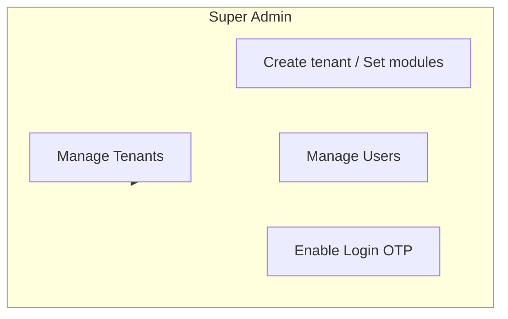
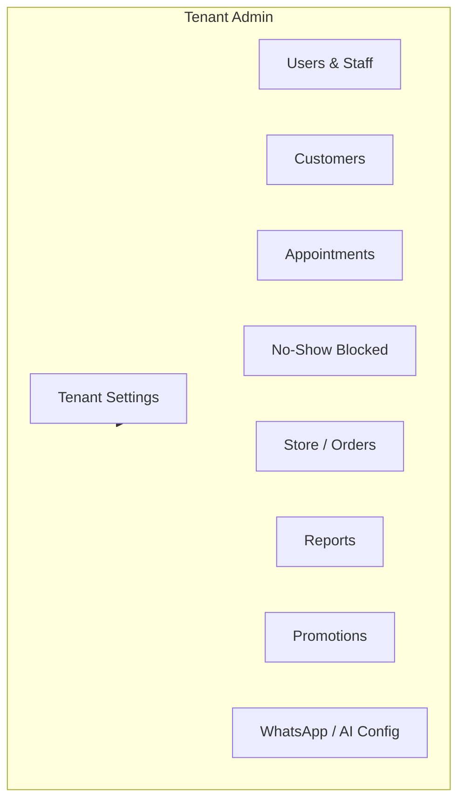
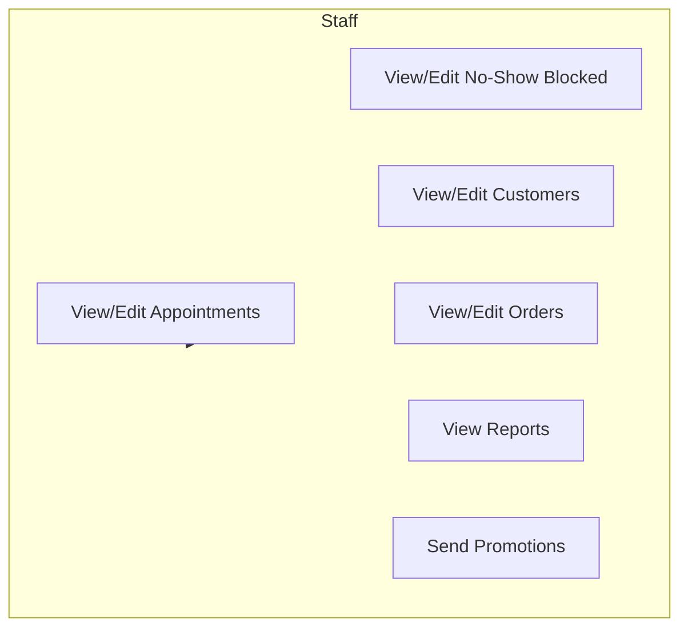
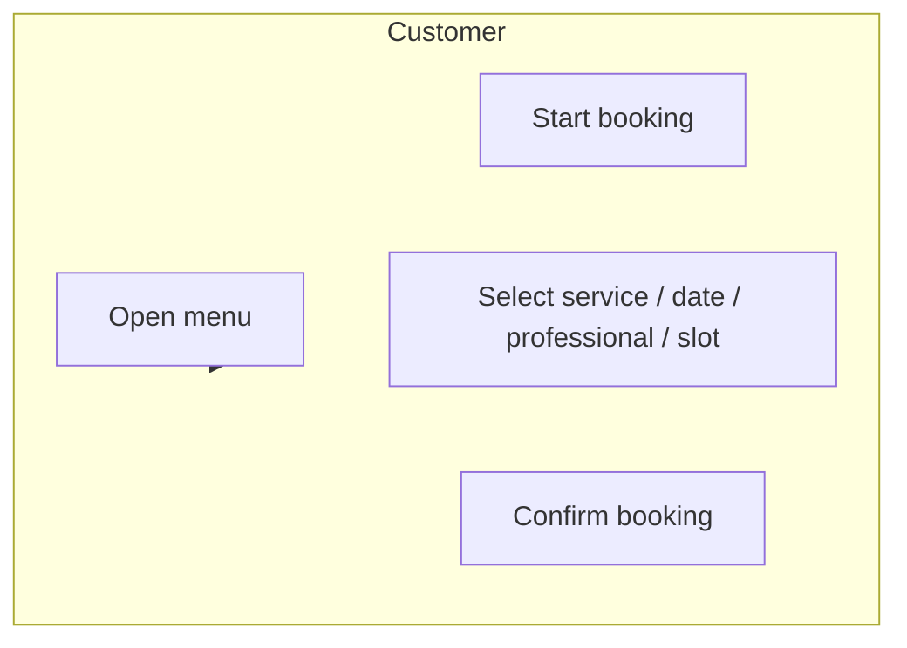

# Business Guide — Module-by-Module

This document describes **what each module does**, **who uses it**, and **step-by-step examples** (in the same style as the No-Show function). It is for product, business, and support.

For technical APIs and fields, see [TECHNICAL_REFERENCE.md](TECHNICAL_REFERENCE.md). For architecture and RBAC, see [APPLICATION_GUIDE.md](APPLICATION_GUIDE.md).

---

## 1. Document overview

- **§2** — Auth & Login (including OTP)
- **§3** — Tenants & settings
- **§4** — Users (tenant admin, staff, capabilities)
- **§5** — Customers
- **§6** — Appointments (create, reschedule, status)
- **§7** — No-Show (blocked list, reset) — **detailed example**
- **§8** — Store (catalog, orders, carts)
- **§9** — Reports
- **§10** — Promotions
- **§11** — Followups, Retention, Staff
- **§12** — WhatsApp (menus, booking flow)
- **§13** — AI (config, predictions, no-show scores)
- **§14** — Use case diagrams (by actor)
- **§15** — Feature matrix

---

## 2. Auth & Login

### What it does

- **Login**: User enters email and password. The system validates credentials and either returns a JWT (direct access) or asks for an OTP.
- **OTP (optional)**: When *Login OTP* is enabled (Super Admin setting), **tenant_admin** and **staff** must enter a one-time code sent by SMS after password check. **Super Admin** never goes through OTP.
- **Session**: After successful login, the client receives an access token (and optionally an HttpOnly cookie). The token carries role, tenant (for tenant_admin/staff), and capabilities.

### Who uses it

- **Super Admin**: Full access; can enable/disable Login OTP for the whole platform.
- **Tenant Admin / Staff**: Log in with email/password; if OTP is on, they complete login by entering the SMS code.

### Example: Login with OTP enabled

1. Tenant admin opens the Login page and enters email + password.
2. Backend validates password; because OTP is enabled and user is not super_admin, it returns `requires_otp: true` and a `session_id` (no JWT yet).
3. System sends an SMS with a 6-digit OTP to the user’s phone (if configured).
4. User enters the OTP on the OTP step screen.
5. Client calls `POST /v1/auth/verify-otp` with `session_id` and `otp`.
6. Backend verifies OTP and returns a JWT. User is logged in; Admin UI uses the token for all subsequent API calls.

**Where it appears**: Login page; Super Admin → Settings (or Auth) for “Login OTP” toggle.

---

## 3. Tenants & Settings

### What it does

- **Tenant**: Represents one business (salon, clinic, store, etc.). Each tenant has a unique ID (e.g. `ss_business_salon`), timezone, category, **modules** (e.g. `core`, `salon`, `store`, `ai`), **capabilities** (e.g. `salon.appointments`, `store.orders`), and optional **ai_config** (no-show threshold, low-stock days, etc.).
- **Settings**: Tenant name, timezone, country code (for phone normalization), appointment defaults, store/payment/delivery config (when store module is on). Only **Super Admin** can change modules/capabilities.

### Who uses it

- **Super Admin**: Creates tenants, sets modules/capabilities, can switch between tenants in the UI.
- **Tenant Admin**: Edits their own tenant’s settings (except modules/capabilities): name, timezone, store config, AI config, etc.

### Example: Configure no-show blocking for a salon

1. Tenant admin opens **Tenant Settings** (or **AI Config** under the tenant).
2. In AI Config they set `no_show_block_threshold` to **3**.
3. Backend saves this in the tenant’s `ai_config`. From now on, any customer with `no_show_count >= 3` will be blocked from booking until an admin resets them.
4. **Where it appears**: Tenant Settings page; AI Config section (when AI module is enabled).

---

## 4. Users

### What it does

- **User**: An account that can log in (email, role, optional tenant). Roles: **super_admin**, **tenant_admin**, **staff**.
- **Super Admin**: No tenant; can access all tenants and change system-wide settings (e.g. Login OTP).
- **Tenant Admin**: Tied to one tenant; full access within that tenant (all pages, all edit/delete).
- **Staff**: Tied to one tenant; access only to **modules/capabilities** assigned to them (View / Edit / Edit sensitive / Delete per entity).

### Who uses it

- **Super Admin**: Creates tenant admins and (optionally) staff; assigns staff to capabilities (e.g. `salon.appointments.view`, `salon.appointments.edit`, `salon.no_show_blocked.edit`).
- **Tenant Admin**: Creates and edits staff; assigns which modules and capability levels each staff can use.

### Example: Add a receptionist with appointment and no-show access

1. Tenant admin goes to **Users** and clicks **Create User**.
2. Enters email, display name, password; selects role **Staff** and assigns capabilities: e.g. **Salon** → Appointments (View + Edit), No-Show Blocked (View + Edit).
3. Backend creates the user with `tenant` = current tenant and `caps` = list of capability IDs.
4. When the receptionist logs in, they see **Appointments** and **No-Show Blocked**; they can mark no-shows and reset blocks. They do not see **Tenant Settings** or **Users** (unless those caps are added).
5. **Where it appears**: Users list; Create/Edit User form with capability checkboxes per module.

---

## 5. Customers

### What it does

- **Customer**: Identified by **phone** (normalized with tenant country code) and optional name. Used for appointments, orders, promotions, and no-show tracking.
- **No-show count**: Each customer has a `no_show_count` (default 0). When an appointment is marked **no_show**, this is incremented; when it reaches the tenant’s `no_show_block_threshold`, that customer is **blocked** from booking (see §7).
- **Status**: Customers can be active/inactive; listing and filters use this.

### Who uses it

- **Tenant Admin / Staff**: List customers, add/import customers, update status. Staff access is subject to capabilities (e.g. `core.customers.view`, `core.customers.edit`).

### Example: Customer appears in No-Show Blocked after three no-shows

1. Customer “Priya” (phone +91-98765-43210) has two past no-shows (so `no_show_count` = 2).
2. She books again; staff create an appointment with her phone. She doesn’t show up; staff set appointment status to **No-show**.
3. Backend increments Priya’s `no_show_count` to 3. Tenant’s `no_show_block_threshold` is 3.
4. Priya now appears in **No-Show Blocked** list. Any new booking with her phone (Admin UI or WhatsApp) is rejected with a “blocked” message until an admin resets her.
5. **Where it appears**: Customers list; Appointments (customer phone/name); No-Show Blocked page (blocked customers only).

---

## 6. Appointments

### What it does

- **Appointment**: Booked slot for a **service** with a **professional** at a **date/time**, linked to a **customer** (phone/name). Statuses include: booked, completed, no_show, cancelled, etc.
- **Flow**: User selects service → date → professional → slot. Before creating, the system checks **no-show block** (customer phone). If blocked, creation fails; otherwise the slot is marked booked and the appointment is created.
- **Reschedule / Cancel**: Reschedule changes date/time/slot; cancel/delete frees the slot and removes or marks the appointment cancelled.

### Who uses it

- **Tenant Admin / Staff**: Create, list, reschedule, cancel appointments; change status (e.g. to no_show). Staff need the right capabilities (e.g. `salon.appointments.view`, `salon.appointments.edit`).
- **Customer (via WhatsApp)**: Can go through the WhatsApp booking flow (service → date → professional → slot → confirm).

### Example: Book an appointment (and block check)

1. Staff opens **Appointments** → **New appointment**. Selects service “Haircut”, date “2025-03-01”, professional “Ravi”, slot “10:00”.
2. Enters customer phone “9876543210” and name “Priya”. Clicks **Book**.
3. Backend normalizes phone with tenant country code, then calls **is_blocked(tenant, phone)**. If Priya’s `no_show_count >= no_show_block_threshold`, the API returns 400 “Customer is blocked from booking due to no-show history.”
4. If not blocked, backend creates the appointment, marks the slot as booked, and returns the new appointment. Staff sees the appointment in the list.
5. **Where it appears**: Appointments list and detail; New/Edit Appointment form; WhatsApp booking flow.

---

## 7. No-Show (Blocked list & Reset) — Detailed example

This section describes the **full no-show lifecycle** in the same style as in APPLICATION_GUIDE §4.3 and §3.1.

### What it does

- **Track**: When an appointment is marked **no_show**, the system increments the customer’s `no_show_count` (by tenant + normalized phone). Customer record is created if it doesn’t exist.
- **Block**: Tenant sets a **no_show_block_threshold** in AI Config (e.g. 3). When a customer’s `no_show_count >= threshold`, they are **blocked** from creating new appointments (Admin UI and WhatsApp).
- **List blocked**: A dedicated page lists all customers with `no_show_count >= threshold`. Optional search by phone or name.
- **Reset**: An admin can **reset** a customer’s no-show count to 0 so they can book again.

### Who uses it

- **Tenant Admin / Staff** (with No-Show Blocked capability): View blocked list, search, reset individual customers.

### Step-by-step (business flow)

| Step | Actor | Action | System behaviour |
|------|--------|--------|-------------------|
| 1 | Staff | Create appointment with customer phone + name | Appointment created; slot marked booked. |
| 2 | Staff | Mark appointment as **No-show** | Slot freed; **increment_no_show_count(tenant, phone)** runs; customer’s `no_show_count` increases by 1 (or customer created with count 1). |
| 3 | — | (Repeated) After N no-shows (N = threshold) | Customer’s `no_show_count` ≥ threshold; they appear in **No-Show Blocked** list. |
| 4 | Customer / Staff | Try to create a new booking with same phone | **is_blocked(tenant, phone)** returns true; API returns error “blocked”; booking is not created. |
| 5 | Staff | Open **No-Show Blocked** page | **list_blocked(tenant, search?)** returns customers with `no_show_count >= threshold`; optional search by phone/name. |
| 6 | Staff | Click **Reset** for one customer | **reset_no_show(tenant, phone)** sets that customer’s `no_show_count` to 0; they can book again. |

### Where it appears in the application

- **Appointments**: Status dropdown includes “No-show”; selecting it triggers the increment.
- **No-Show Blocked** (menu): List of blocked customers; search box; **Reset** button per row.
- **AI Config** (Tenant / AI): Field `no_show_block_threshold` (0 = feature off).
- **WhatsApp**: Booking flow checks block before confirming; customer gets a “blocked” message if applicable.

---

## 8. Store (Catalog, Orders, Carts)

### What it does

- **Catalog**: **Categories** and **products** (name, SKU, price, unit, etc.). **Inventory** per product (quantity, optional variants).
- **Carts**: Cart is keyed by customer **phone**. Items (product, quantity) can be added/updated; **checkout** converts cart to an **order** and clears the cart.
- **Orders**: Order has items, status (e.g. pending, confirmed, delivered), payment info (e.g. dummy provider). Status and line items can be updated by staff.

### Who uses it

- **Tenant Admin / Staff**: Manage categories, products, inventory; view orders; update order status and items. Capabilities: e.g. `store.orders.view`, `store.orders.edit`, `store.catalog`, etc.
- **Customer (via WhatsApp/API)**: Add to cart, checkout (when exposed via integration).

### Example: Place an order from a cart

1. Staff (or integration) has added items to a cart for phone “9876543210” via `PUT /v1/tenants/{tenant}/carts/{phone}`.
2. User triggers **Checkout** via `POST /v1/tenants/{tenant}/carts/{phone}/checkout` (optional payment payload).
3. Backend creates an order with the cart’s items, sets status (e.g. pending), clears the cart, and returns the order.
4. Staff see the order in **Orders** and can change status (e.g. to delivered) or update items.
5. **Where it appears**: Store → Products, Categories, Inventory; Carts (by phone); Orders list and detail.

---

## 9. Reports

### What it does

- **Daily report**: Tenant can **run** a daily report (generates and stores it). They can **list** stored daily reports and **download** a report for a given date (e.g. PDF/Excel link).
- **Analytics**: Endpoints for dashboard data (e.g. summary metrics, retention, top sellers) used by the Admin UI.

### Who uses it

- **Tenant Admin / Staff** (with report capabilities): Run reports, view list, download by date.

### Example: Run and download a daily report

1. User opens **Reports** and clicks **Run daily report**. Backend generates the report for “today” (tenant TZ), stores it, and returns success.
2. User sees the new report in the **Daily reports** list. Clicks **Download** for a date.
3. Backend returns a download link or file for that date’s stored report.
4. **Where it appears**: Reports page (run, list, download).

---

## 10. Promotions

### What it does

- **Promotion**: A campaign with content (e.g. message, media), **audience** (segment or list), and schedule. Can be sent via **WhatsApp** and/or **Email** (if configured).
- **Send**: Admin triggers “Send”; system sends to the selected audience and records logs (e.g. sent, failed) per recipient.
- **Logs**: Per-promotion logs show who received the message and status.

### Who uses it

- **Tenant Admin / Staff** (with promotion capabilities): Create/edit promotions, define audience, send, view logs.

### Example: Send a promotion to “all active customers”

1. User creates a promotion with message “20% off this week” and selects audience “All active customers”.
2. Backend resolves the list of customers (e.g. by tenant + status active). User clicks **Send**.
3. System sends WhatsApp (and/or email) to each recipient and logs result. User opens **Logs** for that promotion to see sent/failed.
4. **Where it appears**: Promotions list; Create/Edit promotion; Send button; Promotion logs.

---

## 11. Followups, Retention, Staff

### Followups

- **What**: Automated follow-up messages (e.g. after appointment) scheduled per tenant. List shows upcoming/sent followups; staff can **cancel** a followup.
- **Who**: Tenant Admin / Staff (followup capability). **Where**: Followups page.

### Retention

- **What**: Customer retention metrics (e.g. summary counts, list of at-risk or churned customers). Used for dashboards and targeting.
- **Who**: Tenant Admin / Staff. **Where**: Retention / Analytics section.

### Staff (salon/clinic “professionals” vs users)

- **What**: **Staff** here means the **professionals** (e.g. stylists, doctors) that appear in appointment booking: name, slots, availability. Managed per tenant (CRUD). This is separate from **Users** (login accounts).
- **Who**: Tenant Admin / Staff (staff capability). **Where**: Staff (or Professionals) page; slot and availability configuration.

---

## 12. WhatsApp

### What it does

- **Menus**: Tenant configures WhatsApp menus (options and actions). Menus can drive a **booking flow** (service → date → professional → slot → confirm).
- **Flow**: Customer sends a message; backend (webhook) may respond with a menu or FSM-driven conversation. For booking, the system checks **no-show block** before confirming.
- **Config**: Tenant sets WhatsApp config (e.g. provider, phone, templates). **Where**: WhatsApp → Menus, Config; Integrations (webhook URL).

---

## 13. AI

### What it does

- **AI Config**: Tenant-level toggles and thresholds stored in `ai_config`: no-show (block threshold, reminder threshold), low-stock (days, lead time, alert days), cart recovery (window hours), etc. See [AI_CAPABILITIES.md](AI_CAPABILITIES.md).
- **Features**: No-show risk scores for upcoming appointments; slot recommendations; low-stock forecast; top sellers; sales forecast; cart recovery insights; dynamic pricing guardrails (if enabled). All respect tenant’s enabled modules and capabilities (e.g. `ai.no_show`, `ai.predictions`, `ai.appointment_recs`).

### Who uses it

- **Tenant Admin / Staff**: Configure AI Config; view predictions, no-show scores, recommended slots in the UI (where exposed).

### Example: Low-stock alert

1. Tenant sets in AI Config: `low_stock_alert_days: 7`, `low_stock_days_default: 30`.
2. User opens **AI → Predictions** (or Low-stock forecast). Backend computes “days to stockout” per SKU; items with `days_to_stockout < 7` are flagged as **alert**.
3. **Where it appears**: AI Config page; Predictions / Low-stock / Cart recovery views.

---

## 14. Use case diagrams (by actor)

Below are **use case diagrams** in Mermaid. Actors: **Super Admin**, **Tenant Admin**, **Staff**, **Customer** (e.g. via WhatsApp).

### 14.1 Super Admin

| Use case | Description |
|----------|-------------|
| Manage Tenants | List all tenants, create tenant, delete tenant. |
| Create tenant / Set modules | Set modules (core, salon, store, ai, etc.) and capabilities. |
| Manage Users | Create tenant_admin and staff; assign capabilities. |
| Enable Login OTP | Toggle login OTP for tenant_admin and staff (system-wide). |

### 14.2 Tenant Admin

Tenant Admin has **full access** within their tenant: all settings, users, customers, appointments, no-show list, store, reports, promotions, WhatsApp, AI config.

### 14.3 Staff

Staff see only **modules/capabilities** assigned to them (e.g. salon appointments + no-show blocked, store orders view/edit). They cannot change tenant settings or modules.

### 14.4 Customer (via WhatsApp)

If the customer is **blocked** (no_show_count >= threshold), the system rejects confirmation and shows a blocked message.

---

## 15. Feature matrix (by module)

| Module / Feature | Super Admin | Tenant Admin | Staff (if caps) | Customer (WhatsApp) |
|------------------|-------------|--------------|-----------------|---------------------|
| Auth / Login OTP toggle | ✓ | — | — | — |
| Tenants (list, create, modules) | ✓ | — | — | — |
| Tenant settings (name, TZ, AI config) | ✓ | ✓ (own tenant) | — | — |
| Users (create, capabilities) | ✓ | ✓ (own tenant) | — | — |
| Customers | ✓ | ✓ | ✓ (if cap) | — |
| Appointments | ✓ | ✓ | ✓ (if cap) | Book via WhatsApp |
| No-Show Blocked (list, reset) | ✓ | ✓ | ✓ (if cap) | — |
| Store (catalog, orders, carts) | ✓ | ✓ | ✓ (if cap) | Cart/checkout if exposed |
| Reports | ✓ | ✓ | ✓ (if cap) | — |
| Promotions | ✓ | ✓ | ✓ (if cap) | Receive messages |
| Followups / Retention | ✓ | ✓ | ✓ (if cap) | — |
| Staff (professionals) | ✓ | ✓ | ✓ (if cap) | — |
| WhatsApp menus / config | ✓ | ✓ | ✓ (if cap) | Use menus |
| AI config & predictions | ✓ | ✓ | ✓ (if cap) | — |

---

For **technical** details (API paths, request/response fields, service functions, sequence diagrams), see [TECHNICAL_REFERENCE.md](TECHNICAL_REFERENCE.md).
