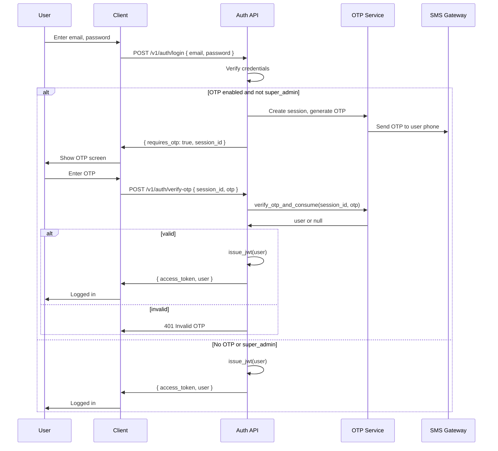
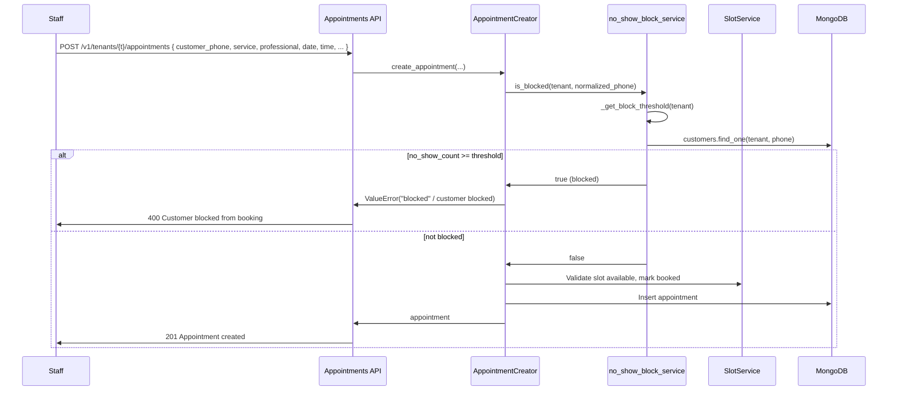
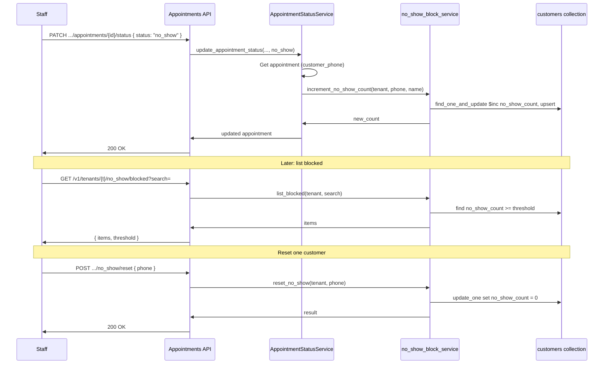
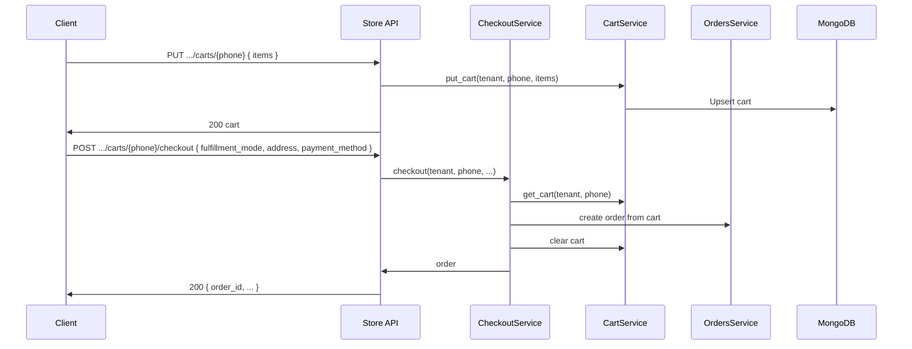
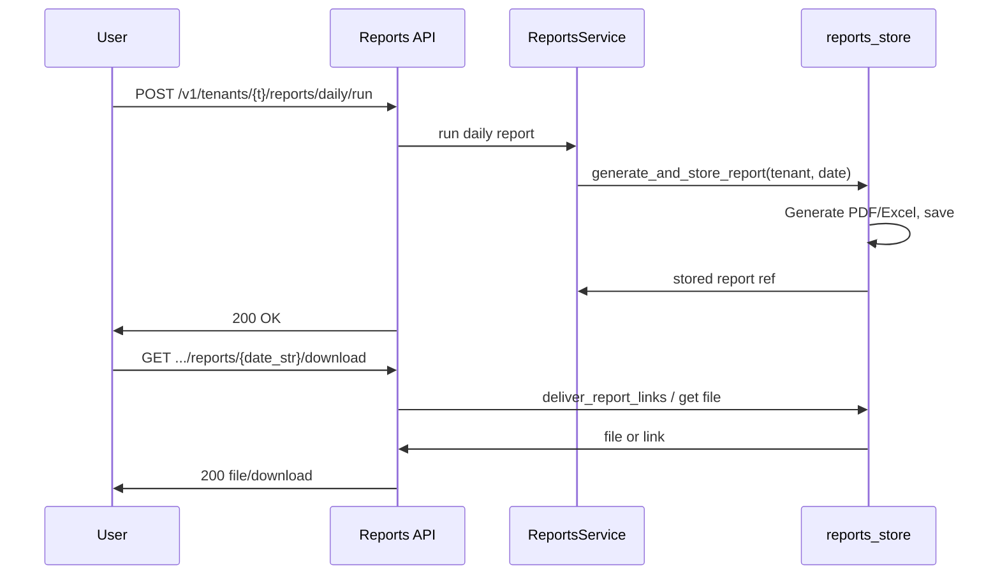
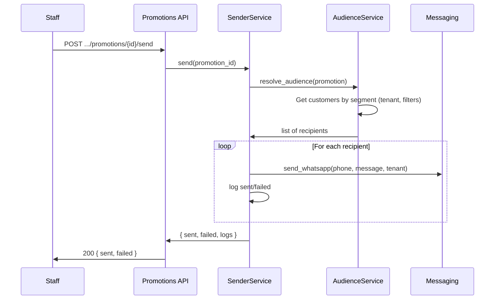

# Technical Reference — APIs, Fields, Functions, Sequences

This document is the **technical** companion to [BUSINESS_GUIDE.md](BUSINESS_GUIDE.md). It lists **APIs**, **main entities/fields**, **key functions**, and **sequence diagrams** for the multi-tenant SaaS application.

All API paths are under prefix **`/v1`** unless noted. Tenant-scoped routes use path parameter **`{tenant}`**. Auth: JWT in `Authorization: Bearer <token>` or HttpOnly cookie.

---

## 1. Auth

### 1.1 API

| Method | Path | Purpose |
|--------|------|---------|
| POST | `/v1/auth/login` | Login with email/password. Returns JWT or `requires_otp` + `session_id`. |
| POST | `/v1/auth/verify-otp` | Complete login with OTP; returns JWT. Body: `{ "session_id", "otp" }`. |
| GET | `/v1/auth/me` | Current user (id, email, role, tenant, display_name, caps). Requires JWT. |
| GET | `/v1/auth/system/login-otp` | Get whether login OTP is enabled. Super Admin only. |
| PATCH | `/v1/auth/system/login-otp` | Enable/disable login OTP. Super Admin only. Body: `{ "login_otp_enabled": bool }`. |

### 1.2 Main request/response fields

- **Login**: `LoginRequest`: `email`, `password`. `LoginResponse`: `access_token`, `token_type`, `expires_in`, `user`. When OTP required: `requires_otp`, `session_id`, `message`.
- **Me**: `id`, `email`, `role`, `tenant`, `display_name`, `caps` (list of capability IDs).

### 1.3 Key functions / files

| Function / component | File | Description |
|----------------------|------|-------------|
| `AuthService.verify_and_issue_token` | `app/services/auth_service.py` | Validates credentials; returns JWT or OTP required payload. |
| `AuthService.issue_jwt` | `app/services/auth_service.py` | Builds JWT from user doc. |
| `verify_otp_and_consume` | `app/services/otp_service.py` | Verifies OTP for session_id; consumes session; returns user or None. |
| `get_system_config` / `set_system_config` | `app/services/system_config_service.py` | Read/write system config (e.g. `login_otp_enabled`). |
| `is_login_otp_enabled` | `app/services/system_config_service.py` | Returns whether OTP is required for non–super_admin login. |

---

## 2. Tenants

### 2.1 API

| Method | Path | Purpose |
|--------|------|---------|
| GET | `/v1/tenants` | List tenants (filtered by role: super_admin all, tenant_admin/staff own). |
| GET | `/v1/tenants/{tenant}` | Get tenant settings (modules, capabilities, ai_config, tz, etc.). |
| PUT | `/v1/tenants/{tenant}` | Update tenant settings. Modules/capabilities: Super Admin only. |
| POST | `/v1/tenants` | Create tenant. Super Admin only. |
| DELETE | `/v1/tenants/{tenant}` | Delete tenant. Super Admin only. |
| PATCH | `/v1/tenants/{tenant}/status` | Activate/deactivate tenant. |
| GET | `/v1/modules` | List available modules. |
| GET | `/v1/plans` | List plans (if used). |

### 2.2 Main entity: tenant document (storage)

| Field | Type | Meaning |
|-------|------|---------|
| `tenant` / `_id` | string | Tenant ID (e.g. `ss_business_salon`). |
| `name` | string | Display name. |
| `tz` | string | IANA timezone (e.g. `Asia/Kolkata`). |
| `country_code` | string | Default country code for phone normalization. |
| `modules` | list[string] | e.g. `core`, `salon`, `store`, `ai`. |
| `capabilities` | list[string] | e.g. `salon.appointments`, `store.orders`. |
| `ai_config` | object | No-show, low-stock, cart recovery, feature toggles (see §13). |
| `payment_config`, `delivery_config` | object | Store-related (when store module enabled). |

### 2.3 Key functions

| Function | File | Description |
|----------|------|-------------|
| `TenantService.list_tenants` | `app/services/core/tenant_service.py` | List all tenants. |
| `TenantService.get_tenant_settings` | `app/services/core/tenant_service.py` | Get one tenant by ID. |
| `TenantService.update_tenant_settings` | `app/services/core/tenant_service.py` | Partial update (including ai_config). |

---

## 3. Users

### 3.1 API

| Method | Path | Purpose |
|--------|------|---------|
| GET | `/v1/users` | List users (filtered by tenant for non–super_admin). |
| POST | `/v1/users` | Create user (email, password, role, tenant, display_name, caps). |
| GET | `/v1/users/{user_id}` | Get user by ID. |
| PATCH | `/v1/users/{user_id}` | Update user (display_name, caps, etc.). |
| PATCH | `/v1/users/{user_id}/password` | Change password. |

### 3.2 Main fields (user)

| Field | Type | Meaning |
|-------|------|---------|
| `_id` / id | string | User ID. |
| `email` | string | Unique (global). |
| `role` | string | `super_admin`, `tenant_admin`, `staff`. |
| `tenant` | string | Required for tenant_admin and staff. |
| `display_name` | string | Optional. |
| `caps` | list[string] | Capability IDs (e.g. `salon.appointments.edit`). |

### 3.3 Key functions

| Function | File | Description |
|----------|------|-------------|
| `UserService` (list, create, get, update) | `app/services/core/user_service.py` | User CRUD. |

---

## 4. Customers

### 4.1 API

| Method | Path | Purpose |
|--------|------|---------|
| GET | `/v1/tenants/{tenant}/customers` | List customers (pagination, filters). |
| POST | `/v1/tenants/{tenant}/customers` | Create/upsert customer. |
| PATCH | `/v1/tenants/{tenant}/customers/{phone}/status` | Update customer status. |
| POST | `/v1/tenants/{tenant}/customers/import` | Bulk import customers. |

### 4.2 Main entity: customer (storage)

| Field | Type | Meaning |
|-------|------|---------|
| `tenant` | string | Tenant ID. |
| `phone` | string | Normalized phone (with tenant country code). |
| `name` | string | Optional. |
| `no_show_count` | int | Incremented when appointment marked no_show; used for block. |
| `status` | string | e.g. active, inactive. |
| `created_at`, `updated_at` | datetime | Audit. |

### 4.3 Key functions

| Function | File | Description |
|----------|------|-------------|
| `CustomerService` (list, create, update status) | `app/services/core/customer_service.py` | Customer CRUD. |

---

## 5. Appointments

### 5.1 API

| Method | Path | Purpose |
|--------|------|---------|
| GET | `/v1/tenants/{tenant}/appointments` | List appointments (professional, date, status, search). |
| POST | `/v1/tenants/{tenant}/appointments` | Create appointment (checks no-show block). Body: tenant, service, professional, date, time, customer_phone, customer_name, etc. |
| DELETE | `/v1/tenants/{tenant}/appointments/{appointment_id}` | Cancel appointment (reason: canceled | needs_reschedule). |
| PATCH | `/v1/tenants/{tenant}/appointments/{appointment_id}/reschedule` | Reschedule (new_time, new_date). |
| PATCH | `/v1/tenants/{tenant}/appointments/{appointment_id}/status` | Update status (booked | completed | no_show). |

### 5.2 Main entity: appointment

| Field | Type | Meaning |
|-------|------|---------|
| `id` | string | Appointment ID. |
| `tenant` | string | Tenant ID. |
| `service` | string | Service name. |
| `professional` | string | Professional name. |
| `date` | string | YYYY-MM-DD. |
| `time` | string | Time label (e.g. 10:00). |
| `customer_phone` | string | Normalized. |
| `customer_name` | string | Optional. |
| `status` | string | booked, completed, no_show, canceled, needs_reschedule, etc. |

### 5.3 Key functions

| Function | File | Description |
|----------|------|-------------|
| `AppointmentService.create_appointment` | `app/services/salon/appointments/appointment_service.py` (via facade) | Orchestrates create; uses `AppointmentCreator`. |
| `AppointmentCreator.create` | `app/services/salon/appointments/appointment_creator.py` | Validates slot, checks `is_blocked(tenant, phone)`, creates appointment, marks slot booked. |
| `AppointmentService.update_appointment_status` | `app/services/salon/appointments/appointment_status_service.py` (or listing) | Updates status; when status → no_show calls `increment_no_show_count`. |
| `AppointmentService.cancel_appointment` | `app/services/salon/appointments/appointment_canceler.py` | Cancels and frees slot. |
| `AppointmentService.reschedule_appointment` | `app/services/salon/appointments/appointment_rescheduler.py` | Reschedule and slot update. |

---

## 6. No-Show Blocked

### 6.1 API

| Method | Path | Purpose |
|--------|------|---------|
| GET | `/v1/tenants/{tenant}/no_show/blocked` | List blocked customers (no_show_count >= threshold). Query: `search` (phone/name). |
| POST | `/v1/tenants/{tenant}/no_show/reset` | Reset one customer’s no_show_count to 0. Body: `{ "phone": "..." }`. |

### 6.2 Key functions (field-by-field behaviour)

| Function | File | Description |
|----------|------|-------------|
| `get_no_show_count(tenant, phone)` | `app/services/salon/appointments/no_show_block_service.py` | Returns current no_show_count for tenant+phone (0 if no customer). |
| `increment_no_show_count(tenant, phone, customer_name)` | Same | Upserts customer; `$inc` no_show_count; returns new count. |
| `is_blocked(tenant, phone)` | Same | True if no_show_count >= no_show_block_threshold (from ai_config). |
| `list_blocked(tenant, search)` | Same | Returns list of customers with no_show_count >= threshold; optional regex search on phone/name. |
| `reset_no_show(tenant, phone)` | Same | Sets no_show_count to 0 for that customer. |
| `_get_block_threshold(tenant)` | Same | Reads no_show_block_threshold from tenant ai_config (0 = disabled). |

**Called from:**

- `AppointmentStatusService` (or equivalent) when status is set to **no_show** → calls `increment_no_show_count`.
- `AppointmentCreator` before creating an appointment → calls `is_blocked`; if true, raises (booking blocked).

---

## 7. Slots & Professionals

### 7.1 API

| Method | Path | Purpose |
|--------|------|---------|
| GET | `/v1/tenants/{tenant}/professionals` | List professional names. |
| POST | `/v1/tenants/{tenant}/professionals` | Create professional. |
| GET | `/v1/tenants/{tenant}/professionals/full` | List professionals with full details. |
| GET | `/v1/tenants/{tenant}/professionals/{professional}/slots` | Get slots for a professional. |
| PUT | `/v1/tenants/{tenant}/professionals/{professional}/slots` | Replace slots. |
| PATCH | `/v1/tenants/{tenant}/professionals/{name}/slots/{time}` | Update one slot (e.g. status). |
| PATCH | `/v1/tenants/{tenant}/professionals/{name}` | Update professional. |
| POST | `/v1/tenants/{tenant}/slots/predict` | Slot prediction (if used). |
| GET | `/v1/tenants/{tenant}/professionals/{professional}/availability` | Availability list. |

### 7.2 Key functions

| Function | File | Description |
|----------|------|-------------|
| `ProfessionalService.get_professionals` | `app/services/salon/professional_service.py` | List professionals. |
| Slot CRUD / overlap | `app/services/salon/appointments/slot_service.py`, `overlap_service.py` | Slot management. |

---

## 8. Services (salon/clinic)

### 8.1 API

| Method | Path | Purpose |
|--------|------|---------|
| POST | `/v1/tenants/{tenant}/services` | Create service. |
| GET | `/v1/tenants/{tenant}/services` | List services. |
| PATCH | `/v1/tenants/{tenant}/services/{name}` | Update service. |
| DELETE | `/v1/tenants/{tenant}/services/{name}` | Delete service. |

---

## 9. Store (Carts, Orders)

### 9.1 API

| Method | Path | Purpose |
|--------|------|---------|
| GET | `/v1/tenants/{tenant}/carts/{phone}` | Get cart for phone. |
| PUT | `/v1/tenants/{tenant}/carts/{phone}` | Set cart items. Body: `{ "items": [...] }`. |
| POST | `/v1/tenants/{tenant}/carts/{phone}/checkout` | Checkout: create order from cart, clear cart. Body: fulfillment_mode, address, payment_method. |
| GET | `/v1/tenants/{tenant}/orders` | List orders (status, search, page, size). |
| GET | `/v1/tenants/{tenant}/orders/{order_id}` | Get order. |
| PATCH | `/v1/tenants/{tenant}/orders/{order_id}/status` | Update order status. Body: `{ "status": "..." }`. |
| PATCH | `/v1/tenants/{tenant}/orders/{order_id}/items` | Update order line items. Body: `{ "items": [...] }`. |
| POST | `/v1/payments/provider/dummy/webhook` | Dummy payment webhook (intent_id, status). |

### 9.2 Main entities

**Cart**: `tenant`, `phone`, `items` (list of { product/sku, qty, etc. }).

**Order**: `tenant`, `order_id`, `phone`, `items`, `status`, `fulfillment_mode`, `address`, `payment_*`, `created_at`, etc.

### 9.3 Key functions

| Function | File | Description |
|----------|------|-------------|
| `CartService.get_cart` / `put_cart` | `app/services/store/cart_service.py` | Get/update cart by tenant+phone. |
| `CheckoutService.checkout` | `app/services/store/checkout_service.py` | Create order from cart; clear cart. |
| `OrdersService.list_orders`, `get_order`, `update_order_status`, `update_order_items` | `app/services/store/orders_service.py` | Order CRUD and status/items. |

---

## 10. Catalog (Products, Categories)

### 10.1 API

| Method | Path | Purpose |
|--------|------|---------|
| GET | `/v1/tenants/{tenant}/categories` | List categories. |
| POST | `/v1/tenants/{tenant}/categories` | Create category. |
| PATCH | `/v1/tenants/{tenant}/categories/{id}` | Update category. |
| DELETE | `/v1/tenants/{tenant}/categories/{id}` | Delete category. |
| GET | `/v1/tenants/{tenant}/products` | List products. |
| POST | `/v1/tenants/{tenant}/products` | Create product. |
| PUT | `/v1/tenants/{tenant}/products/{sku}` | Update product. |
| GET | `/v1/tenants/{tenant}/products/{sku}` | Get product. |
| DELETE | `/v1/tenants/{tenant}/products/{sku}` | Delete product. |
| GET | `/v1/tenants/{tenant}/inventory` | Get inventory (or similar). |
| PUT | `/v1/tenants/{tenant}/inventory` | Update inventory. |
| POST | `/v1/tenants/{tenant}/inventory/adjust` | Adjust stock. |

(Exact paths may vary; see `app/routers/catalog.py` for full list.)

### 10.2 Key functions

| Function | File | Description |
|----------|------|-------------|
| CategoriesService, ProductsService, InventoryService | `app/services/store/categories_service.py`, `products_service.py`, `inventory_service.py` | Catalog and stock. |

---

## 11. Reports

### 11.1 API

| Method | Path | Purpose |
|--------|------|---------|
| POST | `/v1/tenants/{tenant}/reports/daily/run` | Run daily report (generate and store). |
| GET | `/v1/tenants/{tenant}/reports/daily` | List stored daily reports. |
| GET | `/v1/tenants/{tenant}/reports/{date_str}/download` | Download report for date. |
| GET | `/v1/tenants/{tenant}/reports/...` | Other analytics endpoints (see `app/routers/reports.py`). |

### 11.2 Key functions

| Function | File | Description |
|----------|------|-------------|
| Reports service / facade | `app/services/core/reports_service.py`, `reports_facade.py` | Run and store reports. |
| `generate_and_store_report`, `deliver_report_links` | `app/services/reports_store.py` | Generate and deliver. |

---

## 12. Promotions

### 12.1 API

| Method | Path | Purpose |
|--------|------|---------|
| POST | `/v1/tenants/{tenant}/promotions` | Create promotion. |
| GET | `/v1/tenants/{tenant}/promotions` | List promotions. |
| GET | `/v1/tenants/{tenant}/promotions/{promotion_id}` | Get promotion. |
| PUT | `/v1/tenants/{tenant}/promotions/{promotion_id}` | Update promotion. |
| DELETE | `/v1/tenants/{tenant}/promotions/{promotion_id}` | Delete promotion. |
| POST | `/v1/tenants/{tenant}/promotions/{promotion_id}/send` | Send promotion (audience, channels). |
| GET | `/v1/tenants/{tenant}/promotions/{promotion_id}/logs` | Get send logs. |

### 12.2 Key functions

| Function | File | Description |
|----------|------|-------------|
| PromotionService, SenderService, AudienceService | `app/services/core/promotions/promotion_service.py`, `sender_service.py`, `audience_service.py` | Create, send, resolve audience. |

---

## 13. AI

### 13.1 API (summary)

| Method | Path | Purpose |
|--------|------|---------|
| POST | `/v1/tenants/{tenant}/events` | Ingest analytics event (optional). |
| GET | `/v1/tenants/{tenant}/ai/config` | Get effective AI config (merged with defaults). |
| PUT | `/v1/tenants/{tenant}/ai/config` | Update ai_config (partial merge). Body: `{ "ai_config": { ... } }`. |
| GET | `/v1/tenants/{tenant}/ai/forecast_low_stock` | Low-stock forecast (days, lead_time, safety_days, top). |
| GET | `/v1/tenants/{tenant}/ai/top_sellers` | Top sellers (days, top). |
| GET | `/v1/tenants/{tenant}/ai/predictions/summary` | Predictions summary. |
| GET | `/v1/tenants/{tenant}/ai/sales_forecast` | Sales forecast (days, horizon). |
| GET | `/v1/tenants/{tenant}/ai/cart_recovery` | Cart recovery insights (window_hours, top). |
| GET | `/v1/tenants/{tenant}/ai/recommend_slots` | Recommended slots (professional, top). |
| GET | `/v1/tenants/{tenant}/ai/no_show/scores` | No-show risk scores for upcoming appointments. |
| (Others) | See `app/routers/ai.py` | Reschedule propose, dynamic pricing, etc. |

### 13.2 ai_config fields (field-by-field)

| Field | Type | Default | Meaning |
|-------|------|--------|---------|
| `no_show_reminder_threshold` | float | 0.5 | Suggest reminder when no-show score >= this (0–1). |
| `no_show_high_risk_threshold` | float | 0.7 | High risk when score >= this. |
| `no_show_reminder_lead_hours` | int | 24 | Suggest reminder N hours before. |
| `no_show_block_threshold` | int | 3 | Block booking when customer no_show_count >= this; 0 = disabled. |
| `low_stock_days_default` | int | 30 | Default horizon for low-stock forecast. |
| `low_stock_lead_time_days` | int | 3 | Supplier lead time. |
| `low_stock_safety_days` | int | 2 | Safety stock in days. |
| `low_stock_alert_days` | int | 7 | Alert when days_to_stockout < this. |
| `cart_recovery_window_hours` | int | 24 | Window for abandoned cart. |
| `cart_recovery_max_messages_per_cart` | int | 2 | Max messages per cart. |
| `dynamic_pricing_min_multiplier` | float | 0.8 | Min price multiplier. |
| `dynamic_pricing_max_multiplier` | float | 1.2 | Max price multiplier. |
| `dynamic_pricing_max_discount_pct` | float | 20.0 | Max discount %. |
| `slot_recs_prefer_morning` / `slot_recs_prefer_afternoon` | bool | false | Slot recommendation bias. |
| `features` | object | (see config_schema) | Toggles: no_show_scores, appointment_recs, low_stock_forecast, cart_recovery, etc. |

Defined in: `app/services/ai/config_schema.py` (`DEFAULT_AI_CONFIG`, `get_effective_ai_config`).

### 13.3 Key functions

| Function | File | Description |
|----------|------|-------------|
| `get_effective_ai_config(tenant_settings)` | `app/services/ai/config_schema.py` | Merge tenant ai_config with defaults. |
| `AIService` (forecast_low_stock, cart_recovery, no_show scores, recommend_slots, etc.) | `app/services/ai/ai_service.py` | AI feature implementations. |
| `AIPredictor.recommend` | `app/services/ai/predictor.py` | Slot recommendations. |

---

## 14. WhatsApp

### 14.1 API (summary)

| Method | Path | Purpose |
|--------|------|---------|
| GET | `/v1/tenants/{tenant}/whatsapp/menus` | List menus. |
| GET | `/v1/tenants/{tenant}/whatsapp/menus/{menu_id}` | Get menu. |
| POST | `/v1/tenants/{tenant}/whatsapp/menus` | Create menu. |
| POST | `/v1/tenants/{tenant}/whatsapp/menus/{menu_id}/publish` | Publish menu. |
| DELETE | `/v1/tenants/{tenant}/whatsapp/menus/{menu_id}` | Delete menu. |
| GET | `/v1/tenants/{tenant}/whatsapp/config` | Get WhatsApp config. |
| PUT | `/v1/tenants/{tenant}/whatsapp/config` | Update WhatsApp config. |
| POST | `/v1/integrations/twilio/whatsapp/webhook` | Twilio webhook. |
| POST | `/v1/integrations/meta/whatsapp/webhook` | Meta webhook. |
| GET | `/v1/whatsapp/actions` | List dynamic actions (admin). |
| POST | `/v1/bot/whatsapp/next` | Next step in bot flow (admin/test). |

### 14.2 Key functions

| Function | File | Description |
|----------|------|-------------|
| Menu CRUD, config | `app/routers/whatsapp/menus.py`, `app/services/whatsapp/menu_service.py` | Menus and tenant WhatsApp config. |
| Webhook handler, pipeline, workflows | `app/routers/whatsapp/routes.py`, `app/services/whatsapp/pipeline/inbound_pipeline.py`, `workflow/` | Incoming message handling; booking via `usecases/salon/booking_flow.py`. |
| Session | `app/services/whatsapp/session_flow_service.py` | Session read/write for pipeline and menu. |

---

## 15. Other modules (short)

- **Followups**: `GET /v1/tenants/{tenant}/followups`, `POST .../followups/{id}/cancel`. See `app/routers/followups.py`, `app/services/core/followups_service.py`.
- **Retention**: `GET /v1/tenants/{tenant}/customers/retention/summary`, `.../list`. See `app/routers/retention.py`, `app/services/core/retention_service.py`.
- **Staff (professionals list for UI)**: `GET/POST /v1/tenants/{tenant}/staff`, etc. See `app/routers/staff.py`, `app/services/salon/staff_service.py`.
- **Workflows**: `GET/POST /v1/tenants/{tenant}/workflows`, etc. See `app/routers/workflows.py`.
- **Cron**: `GET/POST /v1/admin/cron-jobs/...`. See `app/routers/cron.py`.
- **Admin**: `GET /v1/tenants/{tenant}/analytics`, `.../dashboard/summary`. See `app/routers/admin.py`.
- **Upload**: `POST /v1/tenants/{tenant}/upload`, `GET /v1/uploads/{tenant}/{filename}`. See `app/routers/upload.py`.

---

## 16. Sequence diagrams

### 16.1 Login with OTP

### 16.2 Book appointment (with no-show block check)

### 16.3 No-show: mark no_show → increment → list blocked / reset

### 16.4 Place order (cart checkout)

### 16.5 Run and download daily report

### 16.6 Send promotion

---

## 17. Document references

- **Business view**: [BUSINESS_GUIDE.md](BUSINESS_GUIDE.md)
- **Architecture, RBAC, use cases by industry**: [APPLICATION_GUIDE.md](APPLICATION_GUIDE.md)
- **AI behaviour and config**: [AI_CAPABILITIES.md](AI_CAPABILITIES.md)
- **WhatsApp**: [whatsapp-workflow.md](whatsapp-workflow.md), [whatsapp-workflow-actions.md](whatsapp-workflow-actions.md)
- **Index**: [DOCUMENTATION_INDEX.md](DOCUMENTATION_INDEX.md)
